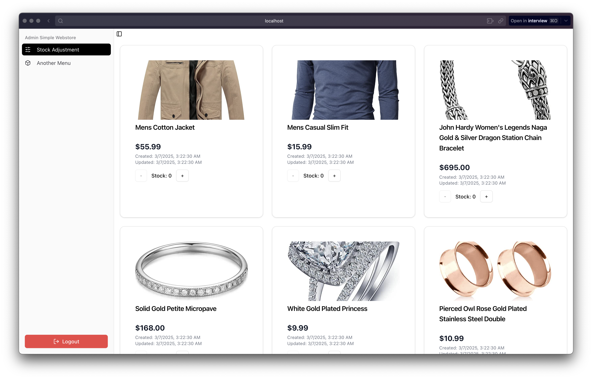
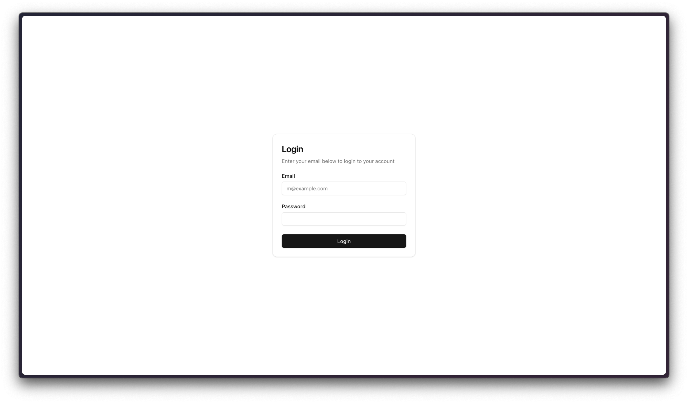
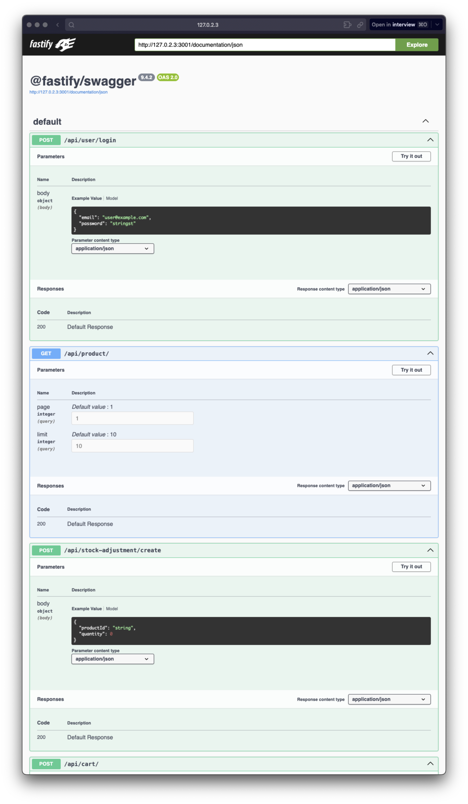

# Simple Webstore

- apps/backend : http://localhost:3001/
- apps/frontend : http://localhost:3000/
- api-documentation : http://localhost:3001/documentation

# How to run it

### 1. Enable Resource (PGSQL)

```sh
docker-compose up -d
```

### 2. Migrate & Seed

```sh
cd apps/backend && pnpm run migrate:latest && pnpm run seed:run && cd -
```

### 3. Run App

```sh
pnpm install && pnpm run dev
```

### 4. Dummy Account

- email : admin@example.com
- password: password123

# Pics




